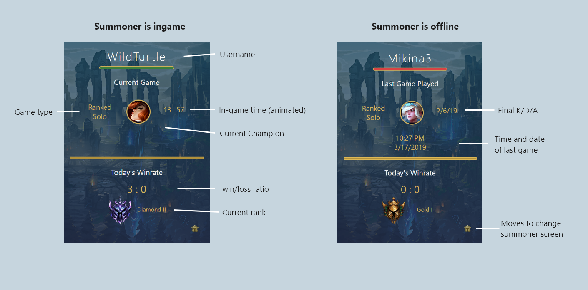

## The information you want at your fingertips

Do you have a friend that is addicted to Leauge of Legends? Sick of cruising through op.gg to see if they are stuck in a 40 minute game or will wake up at noon because they played untill 5 am last night? Well this extention will allow you to quickly check without going out of your way! 

After selecting a summoner simply click on the extention to bring up relevent statisics such as win rate, time last played, rank and current game time. 

### Use
Diffrent information is displayed depending if the player is still in game or not 



Currently this application does not have a permenant API key, you can add your own 24 hour key to the code by updating line one in `popup.js`:

```markdown
`var key = "RGAPI-example";`
```


### Creation
Key actions I wanted to streamline with this extention included:
* Checking if Tyler1 has reached challenger
* Seeing if my boyfriend is not responding because he is is in a game
* Confirming that my boyfriend is an idiot because he played untill 5am before our date
* Checking my own win rate for the day

This application could also potentially be used to check if a streamer is online, since most play only while streaming.

Mockups were done with adobe XD and brought to life through HTML, JS and use of the Riot Games API!

### Ongoing work
- [x] Updating the code to work with Riot API v6
- [x] Updating this page
- [ ] Hiding the API key with AWS
- [ ] Applying for a permanent  API key
